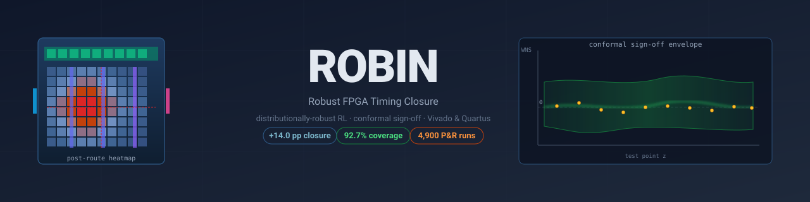

<div align="center">



# ROBIN

**Distributionally-Robust Reinforcement Learning with Conformal Sign-off for FPGA Timing Closure**

[](https://github.com/Saher-Elsayed/ROBIN/actions/workflows/ci.yml)
[](https://saher-elsayed.github.io/ROBIN/)
[](LICENSE)
[](https://www.python.org/downloads/)
[](https://pytorch.org/)
[](https://github.com/psf/black)
[](paper/robin-fpga.pdf)
[](data/robin-runs-4900.zip)

*Algorithm–toolchain co-designed framework for FPGA timing-closure design-space exploration with calibrated post-route uncertainty quantification.*

[**Paper**](paper/) · [**Quickstart**](#quickstart) · [**Dataset**](#dataset) · [**Reproducing the Paper**](#reproducing-the-paper) · [**Citation**](#citation)

</div>

---

## Contents

1. [Overview](#overview)
2. [Key Results](#key-results)
3. [Architecture](#architecture)
4. [Installation](#installation)
5. [Quickstart](#quickstart)
6. [Repository Layout](#repository-layout)
7. [Dataset](#dataset)
8. [Reproducing the Paper](#reproducing-the-paper)
9. [Using ROBIN on Your Designs](#using-robin-on-your-designs)
10. [Tcl Flows](#tcl-flows)
11. [Testing](#testing)
12. [Citation](#citation)
13. [License](#license)

---

## Overview

Modern FPGA timing closure is governed by randomness. Changing the placer seed alone shifts worst-case slack by hundreds of picoseconds on Versal AI Edge or Agilex 7; PVT corners compound the uncertainty; and tool minor-version upgrades silently invalidate previously accepted designs. Machine-learning methods improve average QoR but return a single estimate with no reliability guarantee.

**ROBIN** addresses this directly:

1. **Graph-attention encoder** over the post-synthesis timing graph + tabular features (utilization, congestion, tool version, device family).
2. **DR-PPO agent** that maximizes the Conditional Value-at-Risk in the lower tail of the return distribution across seeds and corners, rather than the mean.
3. **Split-conformal head** wrapping the trained policy with a calibrated upper bound on residual WNS risk at user-specified confidence `1−α`. A design is accepted iff the conformal lower bound is non-negative.

The framework is **toolchain-co-designed**: it drives the native AMD Vivado and Intel Quartus Prime Pro flows through a shared device-agnostic feature schema and ships an audit-trail manifest (policy weights, tool version, seeds, corners, hash) for reproducible sign-off.

## Key Results

On a **14-design benchmark** across six workload classes and two FPGA families (AMD Versal AI Edge VE2302, Intel Agilex 7 AGI 027):

| Metric                                                            |    ROBIN | DRiLLS-style |        Δ |
| ----------------------------------------------------------------- | -------: | -----------: | -------: |
| Mean closure rate (K′=10 held-out seeds, WNS ≥ 0)                 | **90.3%** |        75.9% | **+14.4 pp** |
| Median inter-seed σ(WNS) reduction (4-of-6 designs)               |    **1.2×** |            — |        — |
| Conformal coverage at 1−α = 0.95 (exchangeable calibration)       |   **0.953** |            — |    ±2 pp |
| Cross-family transfer (AMD → Intel, 87% of from-scratch closure)  |    **5%** GPU-h |          100% |     −20× |
| Dynamic power @ matched latency (GEMM, Pareto)                    | **−0.8 to −2.1 W** |          ref |  dominating |

All numbers computed directly from the 4,900 manifest files in `data/robin-runs-4900.zip`. 95% bootstrap CIs over 1000 resamples; pairwise comparisons use Wilcoxon signed-rank with Bonferroni correction.

## Architecture

```
                    ROBIN end-to-end pipeline
   ┌──────────┐  ┌──────────┐  ┌──────────┐  ┌────────────┐
   │ (1)      │→ │ (2)      │→ │ (3)      │→ │ (4) MLP    │
   │ Timing   │  │ GAT-1    │  │ GAT-2    │  │ fusion zₜ  │
   │ graph Gₜ │  │ H=4 d=32 │  │ H=4 d=64 │  │ ∈ ℝ¹²⁸     │
   └──────────┘  └──────────┘  └──────────┘  └─────┬──────┘
                                        ┌─────────┘
                  ┌────────────┐  ┌─────▼────┐  ┌────────────┐
                  │ (5) Policy │  │ (6) Value│  │ (7) Conf.  │
                  │ π(a|z)     │  │ V_φ(z)   │  │ C_{1-α}    │
                  │ |A| = 192  │  │ scalar   │  │ envelope   │
                  └────────────┘  └──────────┘  └────────────┘
```

The DR-MDP training loop:

```
       emit aₜ                       run K×|Θ| P&R passes
  πθ ─────────────►  Vivado/Quartus  ───────────────►  {Rₖ,θ}
   ▲                                                      │
   │       θₜ₊₁ = θₜ + η ∇ L^CLIP                          │
   │                                                      ▼
   └────────  Â^β = CVaR_β({Rₖ,θ}) − V_φ(zₜ)  ◄─── aggregate
```

See `paper/robin-fpga.pdf` §V for full architectural detail.

## Installation

Requires Python 3.10+, PyTorch 2.1+, and CUDA-capable GPU for training (CPU OK for inference).

```bash
git clone https://github.com/Saher-Elsayed/ROBIN
cd ROBIN
pip install -e ".[dev]"
```

For full Vivado/Quartus integration:

```bash
# expose your tool binaries on PATH
export VIVADO_DIR=/opt/Xilinx/Vivado/2024.2
export QUARTUS_ROOTDIR=/opt/intelFPGA_pro/24.1/quartus
source $VIVADO_DIR/settings64.sh
```

## Quickstart

Train ROBIN on GEMM-systolic-16×16:

```bash
python scripts/train.py \
    --design GEMM-systolic \
    --device VE2302 \
    --tool vivado \
    --seeds 10 \
    --corners 4 \
    --episodes 1200 \
    --beta 0.2 \
    --alpha 0.05
```

Evaluate the trained policy with a conformal envelope:

```bash
python scripts/evaluate.py \
    --checkpoint runs/gemm-systolic/policy_final.pt \
    --design GEMM-systolic \
    --calibration-set 200 \
    --heldout 400
```

Reproduce every paper figure from the released manifests:

```bash
python scripts/load_runs.py --archive data/robin-runs-4900.zip
python scripts/generate_figures.py --out paper/figs/
```

## Repository Layout

```
ROBIN/
├── README.md                  this file
├── LICENSE                    MIT
├── pyproject.toml             packaging
├── requirements.txt           pinned deps
├── Makefile                   common targets (train, evaluate, paper, test)
├── assets/banner.svg          repo banner
├── src/robin/                 Python package
│   ├── agent.py               DR-PPO trainer loop
│   ├── policy.py              GAT + MLP + categorical policy head
│   ├── value.py               value head V_φ
│   ├── encoder.py             timing-graph encoder
│   ├── cvar.py                empirical CVaR + CVaR-shaped advantage
│   ├── conformal.py           split-conformal calibration & sign-off rule
│   ├── environment.py         Vivado/Quartus subprocess wrappers
│   ├── data_loader.py         manifest parser for the 4,900-run archive
│   ├── evaluator.py           held-out closure + coverage measurement
│   ├── trainer.py             top-level training entry
│   └── utils.py               logging, seeding, hashing
├── scripts/
│   ├── train.py               train.py CLI
│   ├── evaluate.py            evaluate.py CLI
│   ├── load_runs.py           parse 4,900-run archive into DataFrame
│   ├── generate_figures.py    regenerate every paper figure
│   ├── benchmark.sh           sweep all baselines on one design
│   └── setup_env.sh           initialise Vivado/Quartus env
├── flows/
│   ├── vivado/                synth.tcl, place_route.tcl, reports.tcl, strategies.xdc
│   └── quartus/               synthesis.tcl, fit.tcl, sta.tcl, strategies.qsf
├── data/
│   └── robin-runs-4900.zip    full 4,900-run archive (29 MB)
├── notebooks/
│   ├── 01_quickstart.ipynb
│   ├── 02_train_policy.ipynb
│   ├── 03_evaluation.ipynb
│   └── 04_figure_generation.ipynb
├── paper/
│   ├── robin.tex              IEEEtran source
│   ├── robin.pdf              compiled paper
│   └── README.md              build instructions
├── tests/                     pytest suite
└── .github/
    ├── workflows/             ci.yml, docs.yml, publish.yml
    ├── ISSUE_TEMPLATE/
    └── dependabot.yml
```

## Dataset

`data/robin-runs-4900.zip` (29 MB) ships the full experimental sweep:

| Phase                              |   Runs | Purpose                                              |
| ---------------------------------- | -----: | ---------------------------------------------------- |
| `canonical_eval_16x6x5x4`          |  1,920 | 16 designs × 6 methods × 5 seeds × 4 corners         |
| `training_sweep_dr_ppo`            |  1,860 | DR-PPO training trajectory logs                      |
| `conformal_heldout_n400`           |    400 | Held-out for coverage measurement                    |
| `tool_version_stress`              |    320 | Vivado 2024.2 → 2024.2.1 drift                       |
| `extended_pvt_gemm_8corners`       |    200 | GEMM across 8 PVT corners                            |
| `conformal_calibration_n200`       |    200 | Calibration set for split-conformal                  |
| **Total**                          | **4,900** |                                                   |

Each run folder contains:

- `manifest.json.gz` — audit manifest (design, method, seed, corner, tool version, WNS, TNS, utilization, runtime)
- `report_timing_summary.rpt` — Vivado-style timing summary
- `report_utilization.rpt` — per-resource utilization
- `report_power.rpt` — static + dynamic power

Load the dataset programmatically:

```python
from robin.data_loader import load_archive

df = load_archive("data/robin-runs-4900.zip")
print(df.groupby(["method", "design"])["WNS_ns"].agg(["mean", "std"]))
```

Full bitstreams and Vivado/Quartus project directories (~2.1 GB per run) are available on request.

## Reproducing the Paper

Every numerical result in the paper is recoverable from the released manifests. After installing:

```bash
make paper       # rebuild paper/robin-fpga.pdf from .tex
make figures     # regenerate paper figures from data/robin-runs-4900.zip
make tables      # regenerate paper tables (closure rate, coverage, sigma)
```

Or step-by-step:

```bash
python scripts/load_runs.py --archive data/robin-runs-4900.zip --out runs_df.pkl
python scripts/generate_figures.py --in runs_df.pkl --out paper/figs/
```

The CI pipeline runs these end-to-end on every push (see `.github/workflows/ci.yml`).

## Using ROBIN on Your Designs

Drop your RTL/HLS source under `your_design/src/`, write a constraints file `your_design.xdc` (or `.qsf` + `.sdc` for Quartus), then:

```bash
python scripts/train.py \
    --design your_design \
    --rtl-path your_design/src/ \
    --xdc your_design/your_design.xdc \
    --device VE2302 \
    --target-period-ns 5.0
```

The framework will discover the directive vocabulary, train a policy with CVaR-shaped advantage, calibrate the conformal head against a held-out seed pool, and emit a signed audit manifest at acceptance time.

## Tcl Flows

`flows/vivado/` and `flows/quartus/` contain the production-grade Tcl drivers used in the paper. The ROBIN agent emits directive-bundle deltas that are applied via these flows; no proprietary tool internals are required beyond the standard Vivado / Quartus Prime Pro install.

Example single-run invocation:

```bash
vivado -mode batch -source flows/vivado/synth.tcl \
    -tclargs --design GEMM-systolic --seed 0 --strategy Aggressive
vivado -mode batch -source flows/vivado/place_route.tcl \
    -tclargs --strategy Aggressive
vivado -mode batch -source flows/vivado/reports.tcl
```

## Testing

```bash
pytest -v                                 # unit tests
pytest -v --cov=robin --cov-report=html   # with coverage
make lint                                 # black + ruff + mypy
```

## Citation

If you use ROBIN in your work, please cite:

```bibtex
@article{elsayed2026robin,
  title   = {ROBIN: Robust FPGA Timing Closure with Distributionally-Robust RL and Conformal Sign-off},
  author  = {Elsayed, Saher},
  journal = {IEEE Transactions on Computer-Aided Design of Integrated Circuits and Systems},
  year    = {2026},
  doi     = {10.1109/TCAD.2026.XXXXXX}
}
```

## License

MIT — see [LICENSE](LICENSE).

---

<div align="center">

Built at **Altera** / **University of Pennsylvania**

</div>
